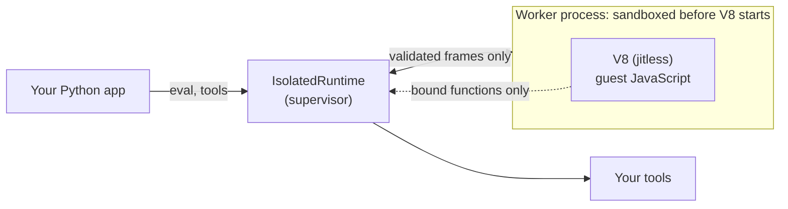

<div align="center">

# pydeno

### Run AI-generated JavaScript from Python, securely, in a sandbox.

Real V8 · supervised worker process · OS-level sandbox · your Python functions as the only way out

[][workflows-tests]
[][pydeno-pypi]
[][pydeno-pypi]
[](LICENSE)
[][pydeno-docs]

[**Quickstart**](#quickstart) ·
[**How it is secure**](#how-it-is-secure) ·
[**How it was tested**](#how-it-was-tested) ·
[**Performance**](#performance) ·
[**Docs**](https://bmsuisse.github.io/pydeno/) ·
[**Security policy**](SECURITY.md)

</div>

---

Agents increasingly answer questions by **writing code**: a data transform, a chart spec, a slide
deck, a loop that calls your tools. That code is untrusted by construction. `pydeno` lets a Python
program run it and get the result back, behind a boundary that holds even if the code is hostile.

```python
from pydeno import IsolatedRuntime, RuntimeConfig

with IsolatedRuntime(RuntimeConfig(timeout=2.0), sandbox="require") as rt:
    rt.bind_function("lookup", lambda sku: {"A1": 3.5}[sku])   # the only thing the guest can call
    print(rt.eval("lookup('A1') * 2"))                          # 7.0
    rt.eval("new Array(2 ** 32 - 1).fill(0)")                   # WorkerCrashed. Your process is fine.
```

## Why pydeno

|  |  |
|---|---|
| 🧱 **Contained** | A V8 abort, a hang or a memory blow-up kills a disposable worker process, never yours. |
| 🔒 **No ambient authority** | No filesystem, network, processes, environment, `Deno`, `process` or `require`. Whatever the guest can do beyond computing, you bound on purpose. |
| 🧰 **Real JavaScript** | The engine behind Chrome and Node ([`deno_core`][deno_core] + [V8][v8]), so model-written code behaves like JavaScript and real libraries run. |
| ⚡ **Fast** | A native Rust wire codec and a pre-started spare worker: as little as ~15 ms to create a runtime and evaluate, a 2 MB result in ~18 ms. |
| 🧪 **Tested like an attacker would** | Assume-breach syscall sweeps against the real kernel, a verified seccomp filter, fuzzing and hostile-worker fakes, on 12 Linux distros and two CPU architectures. |
| 🔌 **Tool-calling built in** | `bind_function` and `ToolBridge` give the model's code your Python tools, with call budgets and errors it can branch on. |

## Quickstart

```bash
pip install pydeno     # or: uv pip install pydeno     (Python 3.10+, macOS or Linux)
```

**Tools the guest can call**, with a total budget:

```python
from pydeno import IsolatedRuntime, ToolBridge

bridge = ToolBridge({"get_weather": get_weather, "send_email": send_email}, max_calls=50)

with IsolatedRuntime(sandbox="require") as rt:
    bridge.attach(rt)
    rt.eval("tools.get_weather('Zurich')")
```

The call that exceeds `max_calls` never reaches your Python function; the guest gets a catchable
`ToolBudgetError`. A Python exception inside a tool reaches JavaScript as a real `Error` whose `name`
is the exception's class, so the model's code can branch on it. Use `redact_host_errors=True` if
exception text must not reach the guest.

**Make the easy path the safe one** (the module-level helpers then use a sandboxed worker):

```python
import pydeno

pydeno.configure_default_runtime(isolated=True, sandbox="require")
pydeno.eval("1 + 1")
```

**Run real libraries.** Many assume browser basics a bare isolate lacks. Opt in to a small,
pure-JavaScript set (virtual-time timers, `TextEncoder`, `btoa`, `Blob`, `EventTarget`,
`AbortController`, `structuredClone`) that never defines `window` or `document`:

```python
from pydeno import IsolatedRuntime, RuntimeConfig, WEB_POLYFILLS

rt = IsolatedRuntime(RuntimeConfig(bootstrap=WEB_POLYFILLS))
```

## Showcase: Python and JavaScript, both sandboxed

A model that writes code wants the best language for each half of the job: Python for wrangling
data, JavaScript for what only the JS ecosystem does well. Pair pydeno with
[Monty][monty] (Pydantic's Python sandbox) and run **both** without trusting either, sharing one
set of host tools and one call budget:

```python
with Monty() as pool, pool.checkout() as py:                      # the model's Python, in Monty
    analysis = py.feed_run(model_python, external_lookup={"fetch_sales": fetch_sales})

with IsolatedRuntime(RuntimeConfig(bootstrap=WEB_POLYFILLS), sandbox="require") as js:
    js.bind_function("getAnalysis", lambda: analysis)             # hand the result across
    js.bind_function("fetch_sales", fetch_sales)                  # the same tool, same budget
    svg = await js.eval_async(model_javascript)                   # the model's JS, in pydeno
```

```text
1. Python half, in Monty
  [python] best region: East (1750)
  [python] refused: PermissionError: Permission denied: '/etc/passwd'
2. JavaScript half, in pydeno
  [js]     refused: Evaluation failed: ReferenceError: fetch is not defined
  [js]     sandbox: seatbelt
3. wrote sales.svg (11021 bytes); tool calls used: 2 of 5
```

<p align="center">
  
</p>

Python crunched the numbers; JavaScript drew the chart with [Vega-Lite](https://vega.github.io/vega-lite/);
each sandbox refused its own attempt to reach outside, and both drew on the same five-call tool
budget. Full runnable example: [`examples/monty_and_pydeno.py`](examples/monty_and_pydeno.py).

## How it works



The worker is a separate process with an empty environment, its own session, no privileges, and an
OS sandbox applied *before* the JavaScript engine exists. The parent enforces the deadline, memory
and call budgets from outside and treats everything the worker sends as untrusted input.

## How it is secure

Defence in depth: each layer assumes the one above it has failed. The threat model is in
[`SECURITY.md`](SECURITY.md) and the details in [the isolation guide](docs/guides/advanced/isolation.md).

| Layer | What it does |
|---|---|
| **Separate process** | Empty environment, own session. A V8 abort, hang or out-of-memory kills the worker; the parent raises `WorkerCrashed` or `RuntimeTimeout`. |
| **OS sandbox, before the engine exists** | macOS: Seatbelt. Linux: Landlock, a private empty root (mount, network, IPC and UTS namespaces) and a seccomp-bpf filter that denies new processes, network, mounts, kernel interfaces, filesystem changes and signals to other processes. Syscalls newer than the reviewed range answer `ENOSYS`. `sandbox="require"` refuses to start unless **every** layer applied. |
| **No privileges** | A worker started as root drops to `nobody` with an empty capability set; `no_new_privs` is set. |
| **Smaller engine surface** | V8 runs `--jitless` (no JIT, no WebAssembly). `SharedArrayBuffer`, `Atomics`, `WeakRef` and `FinalizationRegistry` are removed: they are what timers and garbage-collection probes are built from. |
| **Limits enforced from outside** | Wall-clock deadline (default 60 s), CPU cap, memory ceiling (default 1 GiB), host-call budgets, an in-flight call cap and a write-stall limit. A guest that keeps calling your functions cannot hold the deadline open indefinitely. |
| **The worker is untrusted** | Every frame it sends goes through a strict native decoder with size, depth, node and hash-collision budgets. No pickle, no `eval`. A worker that sends nonsense is killed. |
| **Capability tokens** | A bound function is reachable only through an unguessable token, installed after the binding exists. |
| **Determinism on request** | `clock=` freezes `Date`/`Intl`; `random_seed=` seeds `Math.random`. |

**What it does not promise.** A V8 bug is *contained* to the worker, not prevented, and about 200
syscalls the engine needs stay reachable. For multi-tenant use, run one runtime per trust unit and
put the whole thing in a locked-down container or microVM (see the
[deployment guidance](SECURITY.md)). Libraries that need WebAssembly, a DOM or a canvas do not work.
The engine is only as current as the `deno_core` release it is built on; a weekly check tells
maintainers when a newer V8 becomes available.

## Which runtime?

| | `IsolatedRuntime` | `Runtime` (in-process) |
|---|---|---|
| **Use it for** | Anything a model or a user supplied | Code you wrote or reviewed |
| **A hostile builtin can abort or hang your process** | No: it kills the worker | Yes (`new Array(2 ** 32 - 1).fill(0)`) |
| **`timeout=` always enforced** | Yes (hard kill from outside) | Not for every builtin (e.g. sparse-array `sort`) |
| **OS sandbox** | Yes | No |
| **Start-up** | ~15-45 ms with the spare worker, ~70-105 ms without | microseconds |
| **A host tool call** | Crosses a process boundary (~70 µs per call) | ~12-17 µs ([`BENCHMARKS.md`](BENCHMARKS.md)) |

## How it was tested

The sandbox is tested the way an attacker would try it: from inside, and against the real kernel.

- **Assume-breach syscall sweeps.** A sandboxed process fires *every* syscall in the kernel's table
  with garbage arguments, from a fresh process each time, and records what is still reachable.
  Dangerous calls are fired for real (inside a container, never on a host).
- **The seccomp program is verified, not trusted.** A BPF interpreter in the tests runs the filter's
  decision logic on any platform, and every syscall number in it is checked against the Linux
  kernel's own tables (regenerated from a pinned kernel tag by `scripts/gen_syscall_tables.py`).
- **A capability checklist.** What untrusted code tries first (read or write a file, reach the
  network, spawn a process, read the environment; Deno, Node and browser globals; the runtime's own
  plumbing), through both `eval` and `eval_async`, plus a check that nothing reached the host.
- **Hostile peers.** Fake workers that stop reading, send malformed or oversized frames, flood hash
  tables or lie about types; fuzzing with Hypothesis; and a port of [pydantic/monty][monty]'s
  security suite (the cases an in-process runtime cannot survive are pinned as strict expected
  failures).
- **Two codecs, tested against each other.** The wire codec is native (Rust) with a readable Python
  reference; hundreds of tests, including generated frames, require identical results and errors.
- **Real libraries, inside the sandbox.** pptxgenjs, three.js (GLB export), Vega-Lite and dagre give
  the same results as an unsandboxed runtime, with their bytes pinned in `vendor/libs/`; about 25
  more (d3, ECharts, jsPDF, Tailwind v4, Prettier, ...) were checked by hand.
- **Many kernels.** The Linux suite runs on 12 distro images (Debian, Ubuntu, Fedora, AlmaLinux,
  Amazon Linux; Python 3.10 to 3.14) on both x86_64 and aarch64, and under simulated kernels that
  lack Landlock, seccomp or both, to prove the sandbox degrades honestly and `sandbox="require"`
  fails closed. See [`.github/workflows/test.yml`](.github/workflows/test.yml).
- **Zero skips.** Platform-specific tests are deselected, never skipped; CI enforces a skip budget
  of zero so an unrun test cannot hide.

## Performance

Measured on macOS arm64 (Apple M2) with a release build, on a machine that was not idle, so
ranges are shown. Reproduce with `benches_py/isolated_report.py` and the Criterion and
pytest-benchmark suites ([`BENCHMARKS.md`](BENCHMARKS.md), which also shows 0.5.0 is no slower
than 0.4.5).

| | |
|---|---|
| Create an `IsolatedRuntime` and evaluate | **~15 ms** with the spare worker used soon after it starts, ~30-45 ms after it has sat idle, ~70-105 ms without |
| Move a 2 MB structured result across the boundary | **~18 ms** each way (native codec) |
| `import pydeno` | **~19 ms** (the isolation stack loads on first use) |
| Release extension size | **43 MB**, nearly all of it V8 and its built-in Intl data |
| In-process `Runtime`: a complete host tool call | **~12-17 µs**; a bare `eval` ~6-10 µs |

Jitless V8 (the default for `IsolatedRuntime`) makes compute-heavy code roughly 1.5 to 2 times
slower than with the JIT; `jitless=False` trades that back for a larger attack surface.

## Integrations

- [**FastMCP tool bridge**](examples/fastmcp_tool_bridge.py): expose FastMCP tools to sandboxed JS via `bind_function` and an in-process `fastmcp.Client`
- [**pydantic-ai "code mode" agent**](examples/pydantic_ai_agent.py): the model submits one JS batch script instead of many separate tool calls, run safely with a timeout
- [**ToolBridge**](examples/tool_bridge.py): several Python tools with a total call budget, typed errors the model's JS can branch on, and `console.log` routed back to Python
- [**Monty + pydeno**](examples/monty_and_pydeno.py): the model's Python runs in [Monty][monty], its JavaScript in pydeno, both sandboxed, sharing one tool and one call budget; Python computes, a Vega-Lite chart is drawn in JS
- [**Vendored npm libraries**](examples/vendored_npm_libraries.py): run real npm document-generation libraries (`pptxgenjs`, `pdf-lib`) from their browser bundles inside the sandbox; see the [guide](https://bmsuisse.github.io/pydeno/guides/advanced/vendored-npm-libraries/)
- [**Arrow IPC dataframes**](examples/arrow_ipc_dataframes.py): move 100k+ row tables into the sandbox as Arrow IPC `bytes` instead of JSON objects (5 ms vs 253 ms); see the [guide](https://bmsuisse.github.io/pydeno/guides/advanced/arrow-ipc-dataframes/)

## Documentation

- [Security policy and threat model](SECURITY.md) · [the isolation guide](docs/guides/advanced/isolation.md)
- [Quick Start](https://bmsuisse.github.io/pydeno/quickstart/) · [Concepts](https://bmsuisse.github.io/pydeno/concepts/runtime/) · [Guides](https://bmsuisse.github.io/pydeno/guides/bindings/) · [Use cases](https://bmsuisse.github.io/pydeno/use-cases/ai-agent/) · [API reference](https://bmsuisse.github.io/pydeno/api/pydeno/)
- [Agent skill](skills/pydeno/SKILL.md): an [Agent Skills](https://agentskills.io) `SKILL.md` that teaches coding agents (Claude Code and others) to use pydeno correctly. Copy `skills/pydeno/` into your agent's skills directory, e.g. `.claude/skills/`
- [Benchmarks](BENCHMARKS.md) · [Changelog](CHANGELOG.md)

## Status and contributing

`pydeno` is experimental: expect breaking changes between versions. Found a way out of the
sandbox? Please report it privately, as described in [`SECURITY.md`](SECURITY.md). Everything else:
[issues](https://github.com/bmsuisse/pydeno/issues) and pull requests are welcome; start with
[`docs/contributing/`](docs/contributing/).

Licensed under the [MIT License](LICENSE).

[v8]: https://v8.dev
[deno_core]: https://crates.io/crates/deno_core
[monty]: https://github.com/pydantic/monty
[pydeno-pypi]: https://pypi.org/project/pydeno/
[pydeno-docs]: https://bmsuisse.github.io/pydeno/
[workflows-tests]: https://github.com/bmsuisse/pydeno/actions/workflows/test.yml
