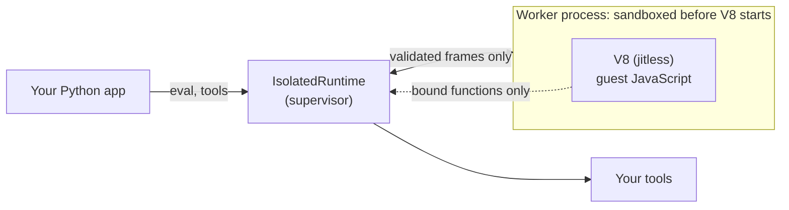

<div align="center">

# pydeno

### The JavaScript sandbox for AI agents' code mode: secure, fast, easy.

Let a model write code, run it in a real V8 inside an OS-sandboxed worker, and get the result back, with the tools you choose as its only way out.

[][workflows-tests]
[][pydeno-pypi]
[][pydeno-pypi]
[](LICENSE)
[][pydeno-docs]

[**Quickstart**](#quickstart) ·
[**Code mode for agents**](#code-mode-for-ai-agents) ·
[**Security**](#security) ·
[**Speed**](#speed) ·
[**How it compares**](#how-it-compares) ·
[**Docs**](https://bmsuisse.github.io/pydeno/) ·
[**Security policy**](SECURITY.md)

</div>

---

Agents increasingly answer by **writing code**: a data transform, a chart, a loop that calls your tools in
parallel instead of one JSON call at a time. That code is untrusted by construction. `pydeno` runs it behind a
boundary that holds even if the code is hostile, and gives it exactly the tools you pass in.

```python
from pydeno import Pydeno

with Pydeno() as pool, pool.checkout() as session:        # OS sandbox required, limits on, warm worker
    session.feed_run("const prices = {A1: 3.5}")
    session.feed_run("prices[sku] * await rate()",         # 7.0: state persists between feeds
                     inputs={"sku": "A1"}, external_lookup={"rate": lambda: 2})
    session.feed_run("new Array(2 ** 32 - 1).fill(0)")     # PydenoCrashedError. Your process is fine.
```

If you know [Monty][monty], you already know `Pydeno`: the same `Pydeno` / `checkout` / `feed_run` /
`feed_start` / `dump` shape, for JavaScript. Where Monty runs a Python subset, pydeno runs **real, modern
JavaScript** (V8, the engine behind Chrome and Node), so model-written code behaves like JavaScript and real
libraries (Vega, ECharts, three.js, d3, pptxgenjs) run unmodified.

|  |  |
|---|---|
| 🤖 **Built for agents** | One call runs a snippet and drives your tools; pause at every tool call for approvals; dump a session to a signed journal and resume it anywhere. |
| 🔒 **Secure by default** | OS sandbox required (no silent downgrade), no filesystem, network, processes or environment, host errors redacted, every limit on, one worker per session. |
| ⚡ **Fast by default** | Pre-started workers: a session checkout takes about a tenth of a millisecond; a warm `eval` about 30 microseconds. |
| 🧱 **Contained** | A V8 abort, a hang or a memory blow-up kills a disposable worker, never your process. |
| 🧪 **Attacked on purpose** | Hostile-guest probes, assume-breach syscall sweeps against the real kernel, and an independent review of every change that touches the boundary. |

## Quickstart

```bash
pip install pydeno     # or: uv pip install pydeno     (Python 3.10+, macOS or Linux)
```

```python
from pydeno import Pydeno

with Pydeno() as pool:
    with pool.checkout() as session:
        session.feed_run("const x = 20")
        print(session.feed_run("x + 1"))                                                          # 21
        print(session.feed_run("await lookup(7)", external_lookup={"lookup": lambda i: i * 6}))   # 42
```

```python
from pydeno import AsyncPydeno

async with AsyncPydeno() as pool:
    async with pool.checkout() as session:
        await session.feed_run("1 + 1")                                                           # 2
```

Defaults: `sandbox="require"` (`pydeno.sandbox_status()` explains a refusal), jitless V8, host errors redacted,
30 s per feed, 512 MiB, 1000 external calls per session, and a worker never serves two sessions. The
[front-door guide](docs/guides/quickstart-pydeno.md) maps every Monty name and limit.

## Code mode for AI agents

Code mode lets the model write one program that calls your tools, instead of one tool call per turn. pydeno
gives that program a safe place to run.

```python
from pydeno import Pydeno

TOOLS = {"search_orders": search_orders, "get_customer": get_customer}      # your Python functions

with Pydeno() as pool, pool.checkout(limits={"max_feed_duration_secs": 10, "max_memory": 256 * 2**20}) as s:
    answer = s.feed_run(
        model_written_javascript,       # e.g. loops over orders, calls get_customer in Promise.all, aggregates
        external_lookup=TOOLS,          # the ONLY way out, with a total call budget
        print_callback=lambda stream, text: log(stream, text),
    )
```

- **Approval flows:** `feed_start` returns a snapshot at **every** tool call; inspect `snapshot.function_name` and
  `snapshot.args`, then `resume(value)` or `resume(error=...)`. `dump()` it and continue in another process.
- **Typed declarations for your prompt:** your tools become `tools.*` functions with TypeScript stubs; JSON-Schema
  tools and a lazy tool catalog keep the prompt small even with hundreds of tools.
- **Agent frameworks:** [`JSCodeMode`](docs/guides/pydantic-ai.md) is the JavaScript counterpart of pydantic-ai's
  Monty-based code mode, and an allow-listed, SSRF-safe [`http_fetch`](docs/guides/http-fetch.md) tool is included.
- **Results you can bound:** `execute()` returns an `ExecutionResult` (stdout, stderr, result, error) with ordered,
  size-capped console output, so one runaway `console.log` cannot flood your logs or your context window.

## Security

pydeno assumes the code is hostile and the engine can have bugs. Each layer assumes the one above has failed.
The threat model is in [`SECURITY.md`](SECURITY.md); the details are in [the isolation guide](docs/guides/advanced/isolation.md).

| Layer | What it does |
|---|---|
| **Separate process** | Empty environment, own session. A V8 abort, hang or out-of-memory kills the worker; the parent raises a typed error. |
| **OS sandbox, applied before the engine exists** | macOS: Seatbelt. Linux: Landlock, a private empty root (mount, network, IPC, UTS namespaces) and a seccomp-bpf filter. `sandbox="require"` refuses to start unless **every** layer applied; the worker proves its own confinement with a self-test first. |
| **No privileges** | A worker started as root drops to `nobody` with an empty capability set; `no_new_privs` is set. |
| **Smaller engine surface** | V8 runs `--jitless` by default. `SharedArrayBuffer`, `Atomics`, `WeakRef` and `FinalizationRegistry` are removed; there is no `Deno`, `process` or `require`. |
| **No code from strings** (opt-in) | `strict_eval=True`: `eval` and `new Function` throw in the guest, so it cannot compile data into code at run time. It removes no engine code and does not cover WebAssembly with `jitless=False`. |
| **Limits enforced from outside** | Wall-clock deadline, CPU cap, memory ceiling, buffer cap, host-call budgets, message and console size. The parent kills a worker that breaks a limit. |
| **The worker is untrusted input** | Every frame goes through a strict native decoder with size, depth and node budgets. A worker that sends nonsense is killed. |
| **Capability tokens, fail-closed binds** | A bound function is reachable only through an unguessable token. A guest that tampers with the scope before a bind makes the bind **fail**, never silently do nothing. |
| **Tenant separation** | One worker per session, never reused; each session's tool threads are its own; thread-locals and contexts never cross sessions. |
| **Signed, replayable sessions** | A journal is HMAC-signed, bound to its owner and release, and replays deterministically; a restored session cannot refund a spent tool budget. |

**How we check it.**

- A battery of **hostile-guest probes** (`scripts/autoresearch/metric_security.py`): poisoned prototypes, forged frames,
  deadline bypasses, memory bombs, state leaking between commands, console escape injection. The goal is zero, and
  every newly found attack class becomes a probe first.
- **Independent review of every change** that touches the worker, wire, bridge, supervision, sandbox policy or
  journals. Reviews have repeatedly found real defects, including in the fixes themselves, which is why they are
  mandatory. The findings table, misses included, is the **[security report](docs/security-report.md)**.
- **Assume-breach syscall sweeps** against the real kernel, a verified seccomp program, fuzzing, hostile-worker
  fakes, and Linux on many distros and both CPU architectures (details below).

**What we do not claim.** A V8 bug is *contained* in the worker, not prevented. V8 is a large engine we cannot
audit end to end, which is why the layers around it exist; there has been no independent outside security review
yet (it is planned before 1.0, see the [roadmap](docs/roadmap.md)). The in-process `Runtime` is **not** safe for
hostile code: use `Pydeno` / `IsolatedRuntime`. Windows has no isolated worker. For multi-tenant use, put the
whole process in a locked-down container or microVM ([deployment guidance](SECURITY.md)).
Found a way out? Please report it privately, as described in [`SECURITY.md`](SECURITY.md).

## Speed

Measured on macOS arm64 with release builds, using paired A/B runs; reproduce with
[`benches_py/alternatives_bench.py`](benches_py/alternatives_bench.py) and
[`scripts/autoresearch/metric_speed.py`](scripts/autoresearch/metric_speed.py). Numbers vary with the machine.

| | |
|---|---|
| A **warm call** on a live sandbox (`eval("1 + 1")`) | about **30 µs** |
| **Check out a session** from the warm pool (`Pydeno().checkout()`) | about **0.1 ms**; a raw `SandboxPool` checkout about 0.04 ms |
| Check out and run a first `feed_run` | about 1.5 ms |
| A **cold start** (new sandboxed worker and first call) | about 50 ms; the pool hides it |
| Move a 2 MB structured result across the boundary | about 18 ms each way (native codec) |

Jitless V8 (the default) makes compute-heavy code roughly 1.5 to 8 times slower than with the JIT;
`jitless=False` trades that back for a larger attack surface, and still runs behind the full OS sandbox.

## How it compares

| | pydeno | [Monty][monty] | A Deno subprocess wrapper |
|---|---|---|---|
| Language | Full modern JavaScript | A subset of Python | Full JavaScript |
| Isolation | Process + OS sandbox + limits, self-tested at start | A small interpreter with no I/O except your functions | Deno's permission system only |
| Limits enforced for you | Memory, CPU, time, buffers, calls, output | Yes | None |
| Pausing, signed resumable sessions | Yes | Yes | No |
| Start-up | Pool checkout about 0.1 ms; cold about 50 ms | Pool checkout microseconds | About 13 ms (measured) |
| Trusted code base | Large (V8), contained | Small, auditable | Large (Deno), one barrier |

Monty is the better choice when the model's code is mostly Python logic and you want the smallest trusted base;
pydeno is the choice when you need JavaScript and its ecosystem. They combine well (see the showcase). The full,
frank comparison, including what pydeno cannot do and measured numbers, is on the
**[alternatives page](docs/alternatives.md)**.

## Advanced: the building blocks

`Pydeno` is built from these, which stay available unchanged.

**Tools the guest can call**, with a total budget:

```python
from pydeno import IsolatedRuntime, ToolBridge

bridge = ToolBridge({"get_weather": get_weather, "send_email": send_email}, max_calls=50)

with IsolatedRuntime(sandbox="require") as rt:
    bridge.attach(rt)
    rt.eval("tools.get_weather('Zurich')")
```

The call that exceeds `max_calls` never reaches your Python function; the guest gets a catchable
`ToolBudgetError`. A Python exception inside a tool reaches JavaScript as a real `Error` whose `name` is the
exception's class, so the model's code can branch on it. Host errors are redacted by default.

**Make the easy path the safe one** (the module-level helpers then use a sandboxed worker):

```python
import pydeno

pydeno.configure_default_runtime(isolated=True, sandbox="require")
pydeno.eval("1 + 1")
```

**Run real libraries.** Many assume browser basics a bare isolate lacks. Opt in to a small, pure-JavaScript set
(virtual-time timers, `TextEncoder`, `btoa`, `Blob`, `EventTarget`, `AbortController`, `structuredClone`) that
never defines `window` or `document`:

```python
from pydeno import IsolatedRuntime, RuntimeConfig, WEB_POLYFILLS

rt = IsolatedRuntime(RuntimeConfig(bootstrap=WEB_POLYFILLS))
```

Async code: `AsyncPydeno`, `AsyncIsolatedRuntime` and `AsyncAgentSandbox` never block the event loop and use no
thread per runtime.

## Showcase: Python and JavaScript, both sandboxed

A model that writes code wants the best language for each half of the job: Python for wrangling
data, JavaScript for what only the JS ecosystem does well. Pair pydeno with
[Monty][monty] (Pydantic's Python sandbox) and run **both** without trusting either, sharing one
set of host tools and one call budget:

```python
with Monty() as pool, pool.checkout() as py:                      # the model's Python, in Monty
    analysis = py.feed_run(model_python, external_lookup={"fetch_sales": fetch_sales})

with IsolatedRuntime(RuntimeConfig(bootstrap=WEB_POLYFILLS), sandbox="require") as js:
    js.bind_function("getAnalysis", lambda: analysis)             # hand the result across
    js.bind_function("fetch_sales", fetch_sales)                  # the same tool, same budget
    svg = await js.eval_async(model_javascript)                   # the model's JS, in pydeno
```

```text
1. Python half, in Monty
  [python] best region: East (1750)
  [python] refused: PermissionError: Permission denied: '/etc/passwd'
2. JavaScript half, in pydeno
  [js]     refused: Evaluation failed: ReferenceError: fetch is not defined
  [js]     sandbox: seatbelt
3. wrote sales.svg (11021 bytes); tool calls used: 2 of 5
```

<p align="center">
  
</p>

Python crunched the numbers; JavaScript drew the chart with [Vega-Lite](https://vega.github.io/vega-lite/);
each sandbox refused its own attempt to reach outside, and both drew on the same five-call tool
budget. Full runnable example: [`examples/monty_and_pydeno.py`](examples/monty_and_pydeno.py).

### More of the same: Python prepares, JavaScript builds

Monty is excellent at the data half, and the JavaScript ecosystem has libraries nothing in Python
matches. Each example below is a complete, tested program: the model's Python runs in Monty, the
model's JavaScript runs in pydeno, neither can reach your files, network or environment, and each
test checks the answer against an independent computation (and Monty's against CPython's).

| Example | Monty (Python) does | pydeno (JavaScript) does | Produces |
|---|---|---|---|
| [3D terrain](examples/monty_three_terrain.py) | layered value-noise heightmap, slope analysis, tree placement | [three.js](https://threejs.org): mesh, normals, vertex colours by slope, instanced trees, raycast line-of-sight | `.glb` 3D model |
| [Orbits](examples/monty_three_orbits.py) | symplectic N-body integrator (figure-eight choreography), energy drift | three.js: speed-coloured tube trails, closest-approach analysis | `.glb` 3D model |
| [Julia relief](examples/monty_three_julia.py) | Monty's own `julia` example: escape-time counts for every grid point | three.js: a mountain range along the fractal's boundary, painted by escape time | `.glb` 3D model |
| [City sun analysis](examples/monty_three_city.py) | procedural city layout and zoning | three.js: extruded buildings, a raycast from every roof to the sun, shade ranking | `.glb` with per-building sunlight |
| [Dependency network](examples/monty_d3_network.py) | synthetic package graph, PageRank, components | [d3](https://d3js.org): force layout run to convergence, Voronoi cells, treemap | one self-contained SVG |
| [Dashboard](examples/monty_echarts_dashboard.py) | a year of metrics: moving average, z-score anomalies, correlations, regression | [ECharts](https://echarts.apache.org): four-panel dashboard, server-side | HTML page with inline SVG, no scripts |
| [Geospatial](examples/monty_turf_geo.py) | fleet GPS tracks, cleaning and resampling | [turf.js](https://turfjs.org): buffer union, hulls, Voronoi service zones, nearest depot | GeoJSON and an SVG map |
| [SQL to chart](examples/monty_sql_charts.py) | answers a business question through a read-only SQL tool | [Vega-Lite](https://vega.github.io/vega-lite/): bars, stacked bars, cohort heatmap | SVG charts |
| [Spreadsheet to deck](examples/monty_spreadsheet_deck.py) | analyses a sheet through a read-only wrapper | [pptxgenjs](https://gitbrent.github.io/PptxGenJS/): native charts, tables, narrative | `.pptx` board deck |

How fast are they together? One warm worker, median of three, on an Apple-silicon Mac, with V8 in
its secure default (`jitless`) and with the JIT turned on:

| Example | jitless (default) | V8 JIT on | JIT speed-up |
|---|---:|---:|---:|
| three.js terrain (129x129 grid) | 879 ms | 180 ms | 4.9x |
| three.js N-body orbits (3000 steps) | 247 ms | 172 ms | 1.4x |
| three.js city sun analysis (6x6 blocks) | 210 ms | 27 ms | 7.9x |
| d3 network layout (200 packages) | 1,619 ms | 198 ms | 8.2x |
| ECharts dashboard (365 days x 4 regions) | 64 ms | 42 ms | 1.5x |
| turf geospatial (8 vehicles) | 1,937 ms | 347 ms | 5.6x |
| SQL question to Vega-Lite chart (4000 orders) | 18 ms | 17 ms | 1.1x |
| spreadsheet to PowerPoint (1000 rows) | 70 ms | 31 ms | 2.3x |

Most turns finish in well under a second even in the secure mode; Monty's data half stays within
about 1.1x of plain CPython. The JIT matters for compute-heavy JavaScript (layouts, raycasting), and
it is exactly the part of V8 where most exploits live, which is why it is off by default. If you
trust the code a little more, `IsolatedRuntime(jitless=False)` buys the second column and still
runs behind the full OS sandbox. Reproduce with
[`benches_py/monty_three_bench.py`](benches_py/monty_three_bench.py).

## How it works



The worker is a separate process with an empty environment, its own session, no privileges, and an
OS sandbox applied *before* the JavaScript engine exists. The parent enforces the deadline, memory
and call budgets from outside and treats everything the worker sends as untrusted input.

## Which runtime?

| | `IsolatedRuntime` | `Runtime` (in-process) |
|---|---|---|
| **Use it for** | Anything a model or a user supplied | Code you wrote or reviewed |
| **A hostile builtin can abort or hang your process** | No: it kills the worker | Yes (`new Array(2 ** 32 - 1).fill(0)`) |
| **`timeout=` always enforced** | Yes (hard kill from outside) | Not for every builtin (e.g. sparse-array `sort`) |
| **OS sandbox** | Yes | No |
| **Start-up** | pool checkout ~0.1 ms, cold ~50 ms | microseconds |
| **A host tool call** | Crosses a process boundary | In process, ~12-17 µs ([`BENCHMARKS.md`](BENCHMARKS.md)) |

## How it was tested

The sandbox is tested the way an attacker would try it: from inside, and against the real kernel.

- **Assume-breach syscall sweeps.** A sandboxed process fires *every* syscall in the kernel's table
  with garbage arguments, from a fresh process each time, and records what is still reachable.
  Dangerous calls are fired for real (inside a container, never on a host).
- **The seccomp program is verified, not trusted.** A BPF interpreter in the tests runs the filter's
  decision logic on any platform, and every syscall number in it is checked against the Linux
  kernel's own tables (regenerated from a pinned kernel tag by `scripts/gen_syscall_tables.py`).
- **A capability checklist.** What untrusted code tries first (read or write a file, reach the
  network, spawn a process, read the environment; Deno, Node and browser globals; the runtime's own
  plumbing), through both `eval` and `eval_async`, plus a check that nothing reached the host.
- **Hostile peers.** Fake workers that stop reading, send malformed or oversized frames, flood hash
  tables or lie about types; fuzzing with Hypothesis; and a port of [pydantic/monty][monty]'s
  security suite (the cases an in-process runtime cannot survive are pinned as strict expected
  failures).
- **Two codecs, tested against each other.** The wire codec is native (Rust) with a readable Python
  reference; hundreds of tests, including generated frames, require identical results and errors.
- **Real libraries, inside the sandbox.** pptxgenjs, three.js (GLB export), Vega-Lite and dagre give
  the same results as an unsandboxed runtime, with their bytes pinned in `vendor/libs/`; about 25
  more (d3, ECharts, jsPDF, Tailwind v4, Prettier, ...) were checked by hand.
- **Many kernels.** The Linux suite runs on 12 distro images (Debian, Ubuntu, Fedora, AlmaLinux,
  Amazon Linux; Python 3.10 to 3.14) on both x86_64 and aarch64, and under simulated kernels that
  lack Landlock, seccomp or both, to prove the sandbox degrades honestly and `sandbox="require"`
  fails closed. See [`.github/workflows/test.yml`](.github/workflows/test.yml).
- **Zero skips.** Platform-specific tests are deselected, never skipped; CI enforces a skip budget
  of zero so an unrun test cannot hide.
- **The worker proves its own confinement.** Before any guest code exists it tries to read a file,
  write one, spawn a process, connect out, signal its parent and (on macOS) read the parent's
  environment and the machine's hardware ID; a complete sandbox that lets one through refuses to
  start. Each probe is also checked in reverse: it must report a breach in an unsandboxed process.
- **Independent review, and what it found.** Three AI reviewers (each given a separate slice of the
  sandbox and told to reproduce before reporting), GitHub Copilot, and research into how vm2,
  SandboxJS, isolated-vm and Monty were attacked. The result is a findings table that lists the
  misses as well as the catches, including a macOS leak of the host's environment, a bridge bug that
  let a guest abort the process, and a V8 x86_64 startup trap that only a native x86_64 run revealed.
  Read it in the **[security report](docs/security-report.md)**.

## Integrations

- [**FastMCP tool bridge**](examples/fastmcp_tool_bridge.py): expose FastMCP tools to sandboxed JS via `bind_function` and an in-process `fastmcp.Client`
- [**pydantic-ai code mode (`JSCodeMode`)**](docs/guides/pydantic-ai.md): the JavaScript counterpart of pydantic-ai's Monty-based code mode. The agent gets one `run_javascript` tool; your other tools become typed `tools.*` functions the model's code calls with `await` and `Promise.all`, with retries, usage limits and approvals mapped onto pydantic-ai's own. Runs offline: [`examples/pydantic_ai_agent.py`](examples/pydantic_ai_agent.py). `pip install "pydeno[pydantic-ai]"`
- [**Agent sessions (`AgentSandbox`)**](docs/guides/agent-sessions.md): state across turns, pause and resume at every tool call (approval flows), a signed replay journal you can `dump()` and `load()`, and the tool descriptions and `.d.ts` for your prompt
- [**ToolBridge**](examples/tool_bridge.py): several Python tools with a total call budget, typed errors the model's JS can branch on, and `console.log` routed back to Python
- [**Monty + pydeno**](examples/monty_and_pydeno.py): the model's Python runs in [Monty][monty], its JavaScript in pydeno, both sandboxed, sharing one tool and one call budget; Python computes, a Vega-Lite chart is drawn in JS
- [**Vendored npm libraries**](examples/vendored_npm_libraries.py): run real npm document-generation libraries (`pptxgenjs`, `pdf-lib`) from their browser bundles inside the sandbox; see the [guide](https://bmsuisse.github.io/pydeno/guides/advanced/vendored-npm-libraries/)
- [**Arrow IPC dataframes**](examples/arrow_ipc_dataframes.py): move 100k+ row tables into the sandbox as Arrow IPC `bytes` instead of JSON objects (5 ms vs 253 ms); see the [guide](https://bmsuisse.github.io/pydeno/guides/advanced/arrow-ipc-dataframes/)

## Documentation

- [Security policy and threat model](SECURITY.md) · [the isolation guide](docs/guides/advanced/isolation.md)
- [Quick Start](https://bmsuisse.github.io/pydeno/quickstart/) · [Concepts](https://bmsuisse.github.io/pydeno/concepts/runtime/) · [Guides](https://bmsuisse.github.io/pydeno/guides/bindings/) · [Use cases](https://bmsuisse.github.io/pydeno/use-cases/ai-agent/) · [API reference](https://bmsuisse.github.io/pydeno/api/pydeno/)
- [Agent skill](skills/pydeno/SKILL.md): an [Agent Skills](https://agentskills.io) `SKILL.md` that teaches coding agents (Claude Code and others) to use pydeno correctly. Copy `skills/pydeno/` into your agent's skills directory, e.g. `.claude/skills/`
- [Benchmarks](BENCHMARKS.md) · [Changelog](CHANGELOG.md)

## Status and contributing

`pydeno` is experimental: expect breaking changes between versions. Found a way out of the
sandbox? Please report it privately, as described in [`SECURITY.md`](SECURITY.md). Everything else:
[issues](https://github.com/bmsuisse/pydeno/issues) and pull requests are welcome; start with
[`docs/contributing/`](docs/contributing/).

Licensed under the [MIT License](LICENSE).

## Acknowledgements

pydeno began as a fork of [**jsrun**](https://github.com/imfing/jsrun) by Xin Fu, which had the
original idea of a Python library that runs JavaScript on a Rust runtime built on `deno_core`. We took
that idea and its foundations, then changed a great deal: the sandboxed worker process and OS
confinement, the tool boundary, the wire codec, the resource limits, and most of the tests are new.
Thank you to jsrun for the starting point. The [MIT licence and original copyright](LICENSE) are kept,
and [`docs/contributing/upstream-divergence.md`](docs/contributing/upstream-divergence.md) records
what came from where.

Thanks also to [Monty](https://github.com/pydantic/monty) by Pydantic, whose design for running
agent-written code (limits, host functions, a public challenge to break it) shaped how we think about
this problem; the two sandboxes work well side by side.

[v8]: https://v8.dev
[deno_core]: https://crates.io/crates/deno_core
[monty]: https://github.com/pydantic/monty
[pydeno-pypi]: https://pypi.org/project/pydeno/
[pydeno-docs]: https://bmsuisse.github.io/pydeno/
[workflows-tests]: https://github.com/bmsuisse/pydeno/actions/workflows/test.yml
