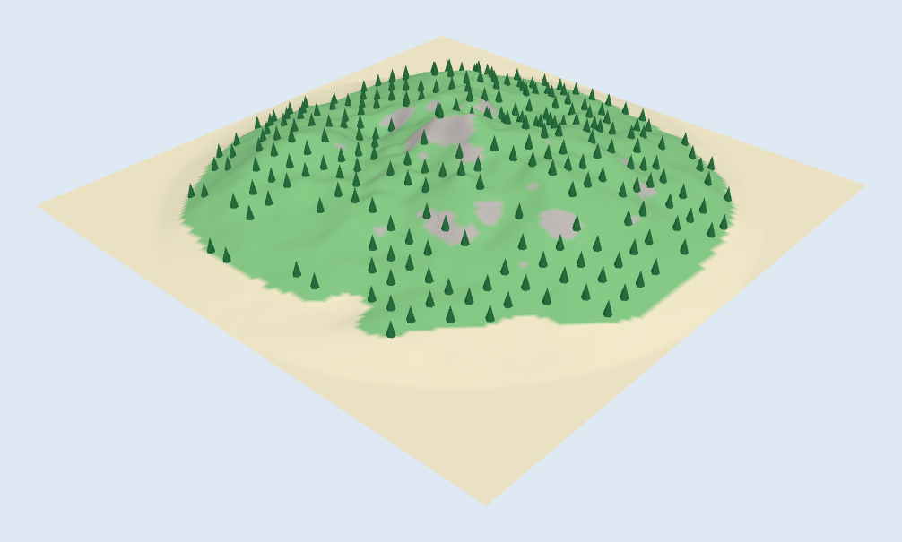
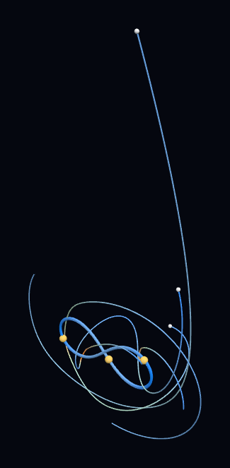
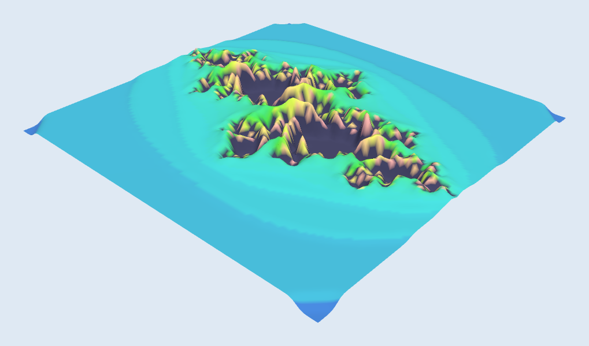
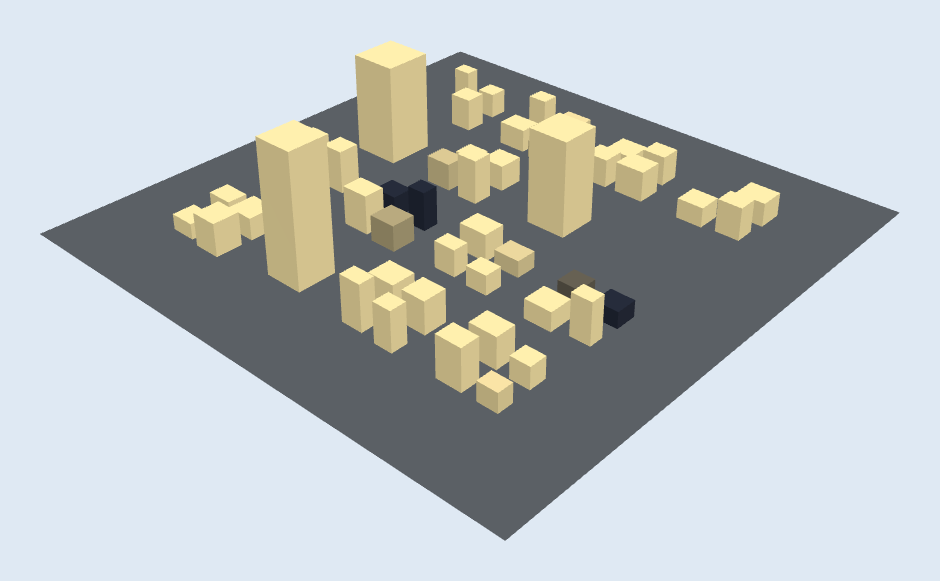
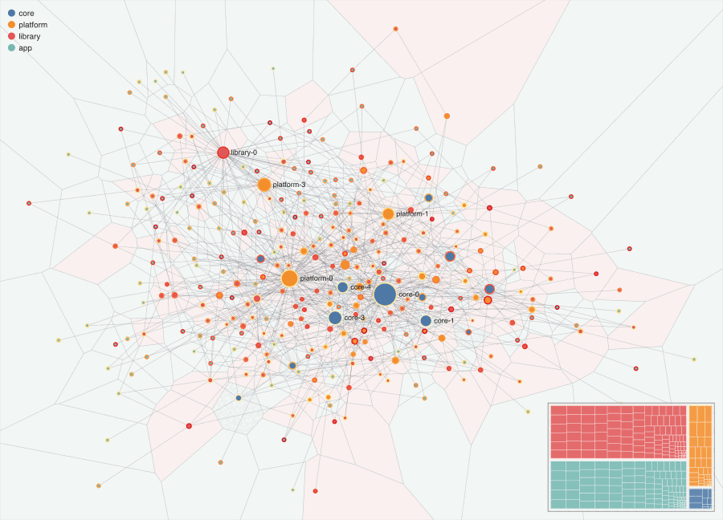
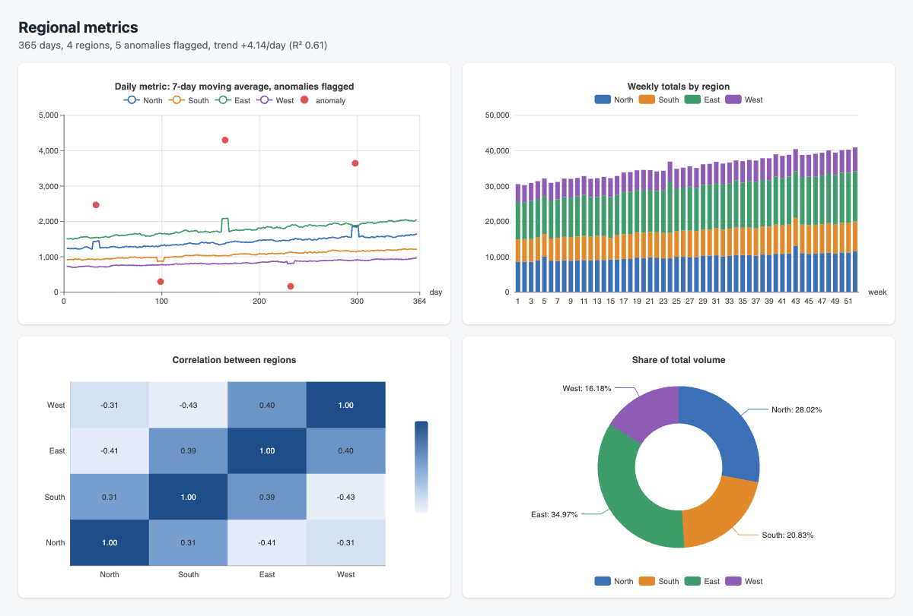
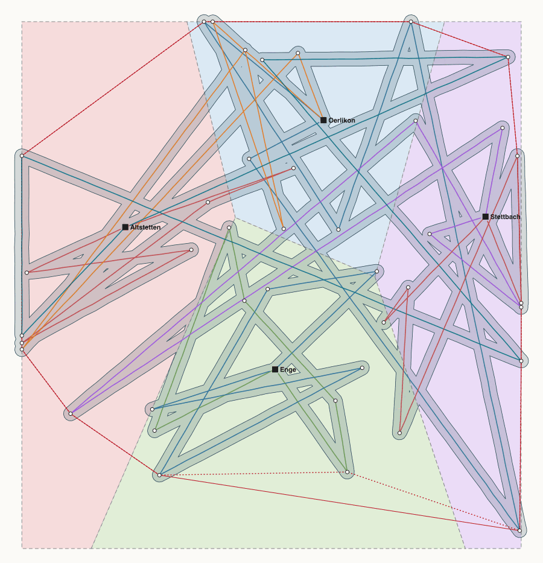
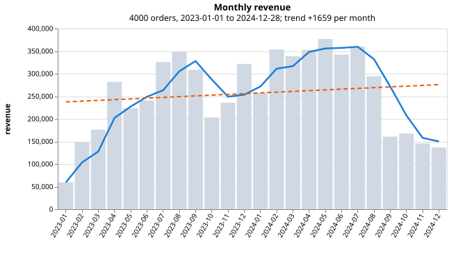
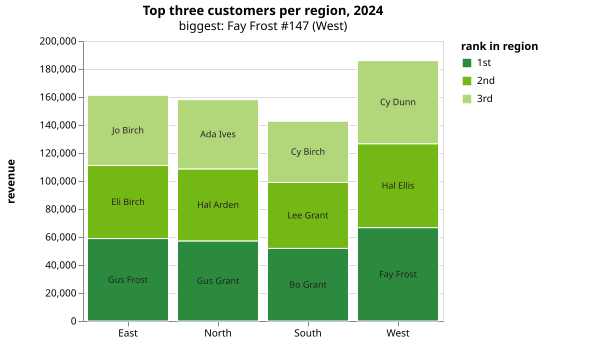
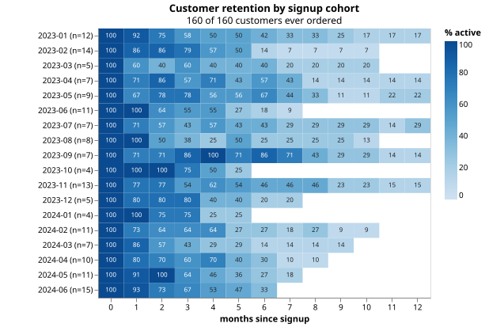

# Monty + pydeno gallery

Each example pairs Python running in [Monty](https://github.com/pydantic/monty) (the data half) with
JavaScript running in pydeno (the drawing half). Neither can reach your files, network or
environment. The pictures below are the actual outputs of the scripts in
[`examples/`](https://github.com/bmsuisse/pydeno/tree/main/examples), run from a checkout; the 3D
models are rendered here from the exported `.glb` files with three.js. The root `README.md` has the
table of what each half does.

## 3D models (three.js, exported as `.glb`)

`examples/monty_three_terrain.py`: a procedural island. Monty makes the heightmap and tree placement; three.js builds the mesh, paints it by height and slope and instances the trees.

`examples/monty_three_orbits.py`: an N-body simulation. Monty integrates the orbits; three.js turns each trail into a speed-coloured tube.

`examples/monty_three_julia.py`: escape-time counts from Monty's own `julia` example, extruded into a relief along the fractal's boundary.

`examples/monty_three_city.py`: a procedural city. Monty lays it out; three.js casts a ray from every roof to the sun and darkens the buildings that are shaded.

## Charts and maps (SVG and HTML)

`examples/monty_d3_network.py`: a package dependency graph. Monty computes PageRank and components; d3 runs the force layout and draws it as one [self-contained SVG](../assets/examples/monty_d3_network.svg).

`examples/monty_echarts_dashboard.py`: a year of regional metrics. Monty finds the anomalies, correlations and trend; ECharts draws the four panels server-side into an HTML page with inline SVG.

`examples/monty_turf_geo.py`: fleet GPS tracks. Monty cleans and resamples them; turf.js buffers, hulls and partitions them into service zones ([SVG](../assets/examples/monty_turf_geo.svg)).

`examples/monty_sql_charts.py`: a business question answered through a read-only SQL tool, then drawn with Vega-Lite (revenue by month, top customers by region, cohort retention).
